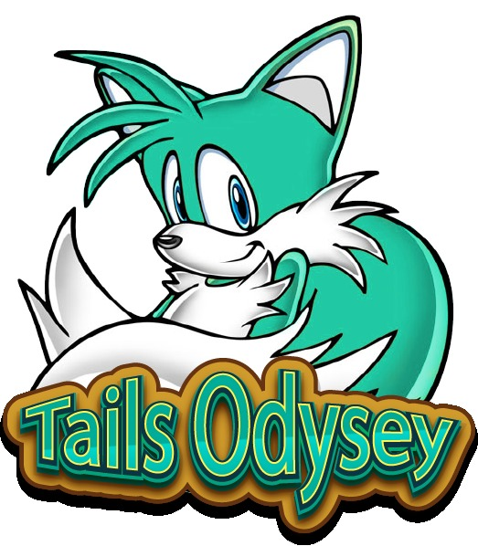
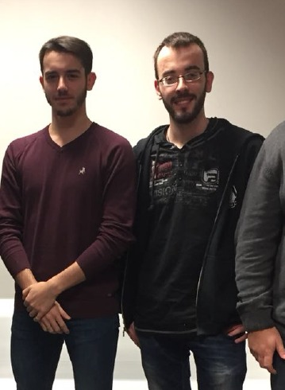

# Tails Odyssey

This two level plataformer was created by Éric Canela, and Rafel Brau, 
both students in UPC's degree in Design and Development of Videogames.
We made this game during the subject of Development. The task was to make a simple 2Dplataformer, but we added the gliding so the movement was more fluid.

_Tails Odyssey Logo_

# Authors

 <em> Rafel Brau, Èric Canela </em>

- Rafel Brau
    - [Github](https://github.com/Rafefix)

- Èric Canela
    - [Github](https://github.com/knela96)
    
While both members worked hard on this project, each member had different approaches on the game. Rafel focused more on the aesthetic part, he did animations, level design, got all the assets and coded alongside Eric, who focused more on the logical part of the game. He prepared the movement for the player, the general logic for the gui, entities, collisions and pathfinding, and focused on the readability and cleanliness of the code.

This game icludes pathfinding enemies which are distributed by an entity manager, a gui system with buttons, labels, sliders and images, and when it comes to innovation, pressing the spacebar while in the air lets you glide for two seconds, letting you be more accurate when landing, besides this, when you fall from a platform you don't respawn at the start of the level, but the last position you were on ground.The player can attack and kill enemies with a tail move. 

## Gameplay

<iframe width="560" height="315" src="https://www.youtube.com/embed/d3x9qMkyWIA" frameborder="0" allow="accelerometer; autoplay; encrypted-media; gyroscope; picture-in-picture" allowfullscreen></iframe>

# Controls

A - Move left

D - Move right

E - Attack forward

Spacebar - Jump

Esc - Pause menu 

Spacebar while in the air - Glide for two seconds

## Link to download the latest version of the game  
  [CLICK HERE](https://github.com/knela96/Tails-Odyssey/releases/tag/1.0)

## Link to our github repository
  [CLICK HERE](https://github.com/knela96/Tails-Odyssey)
 
## Link to the License
  [CLICK HERE](https://github.com/knela96/Tails-Odyssey/blob/master/LICENSE)

